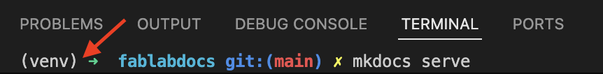

# Website Guide

Denne guide er et forsøg på at guide dig igennem hvordan man installerer og konfigurerer sit værktøj til at redigere i hjemmesiden.

Siden er bygget ved hjælp af Material for MkDocs, koden bor på GitHub og selve hjemmesiden er hostet af Github Pages, der ved hjælp af en Github Action automatisk genererer hjemmesiden når koden bliver opdateret.

Den del er beskrevet i [ci.yml](https://github.com/fablabskanderborg/docs/blob/main/.github/workflows/ci.yml) filen. Den er baseret på dokumentationen fundet hos [Material for MkDocs](https://squidfunk.github.io/mkdocs-material/publishing-your-site/) og kun opdateret minimalt.

Vores værktøjskasse til denne guide er:

- :fontawesome-brands-windows: En Windows maskine

- :material-microsoft-visual-studio-code: Visual Studio Code, [download](https://code.visualstudio.com/Download)

- :simple-materialformkdocs: Material for MkDocs, [website](https://squidfunk.github.io/mkdocs-material/)

- :fontawesome-brands-python: Python, [python.org](https://www.python.org/)

- :fontawesome-brands-git: Git, [download](https://git-scm.com/install/windows)

Hurtig overflyvning:

Installer :material-microsoft-visual-studio-code: Visual Studio Code, Git, og Python på din windows maskine.

Klon :simple-github: fablabskanderborg/docs repoet

(indsæt billede af VS Code der viser dette)


lav et [Python Virtual Enviroment](https://realpython.com/what-is-pip/#using-pip-in-a-python-virtual-environment) til mkdocs og plugins


```
source venv/bin/activate
```


```
 pip3 --version
```
eller 
```
 pip --version
```

Bekræft at du er i dit Virtuel Enviroment og installer mkdocs 



``` 
pip install mkdocs-material mkdocs-static-i18n
```

Nu burde du kunne bruge 
```
mkdocs build
mkdocs serve
```
og få et resultat eller i det mindste en fejl du kan søge på.


